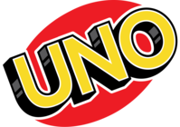

# CS205 Team Five Final Project: UNO
This project is an implementation of the game UNO using the pygame framework. 

## Running
- via SSH: `git clone git@gitlab.uvm.edu:Ryan.D.Joseph/cs205-team-five-final-project-uno.git`
- via HTTPS: `git clone https://gitlab.uvm.edu/Ryan.D.Joseph/cs205-team-five-final-project-uno.git`

Make sure you have pip installed the appropriate version of pygame, and run `python Main.py`. You will be presented with a start screen with options to pick 1-3 AI opponents, and easy-medium-hard difficulty (the details of which are described below).

This app was tested with python3, particularly python3.6.9. It should, but may not, work for Python2.

## Options
The game can be played with 1-3 computer players, at the choice of the user player. There is also an option for the difficulty of the computer player:

- *Easy*: Computer makes a random choice
- *Medium*: Computer calculates the largest possible chain of plays based on color/symbol, and picks that path, preferring to play draw cards and skip cards
- *Hard*: The AI uses a Monte Carlo tree search 

## Implementation Notes 
- Sometimes you have to double click on a card to get it to play, because pygame's event queue will lose events
- The computer player's onscreen hand is capped at 13 cards, but can grow to any size internally. This visual cap was instrumented to simplify drawing multiple onscreen opponents, so it may look like the AI is not doing anything, but it may be drawing cards.
- An attempt was made to introduce a thread to listen for pygame events independent of the main game, which would allow the player to 'X' out the game at any time, but this caused major conflicts with how pygame's event queue/framework works, so it was discarded. Consequently, the player can only 'X' out of the game when it is their turn.
- The hard difficulty, with multiple opponents, can cause some lag due to all of them running a Monte Carlo tree search every turn. 
- We had planned further animations beyond playing and drawing cards, however we ran into difficulties implementing them within the MVC framework we had, so they were scrapped

## Style Guide
- Function and class names are in camelCase
- Variable names are in snake_case
- All functions/methods should include a docstring 

## UNO Rules
- Everyone is dealt 7 cards
- Play goes clockwise with each player playing a card where a card can be played if it matches the color or symbol of the top card on the discard pile
- Special cards:
    - A wild can be played at any time, and the player who plays it chooses the new color
        - A draw four wild makes the next player draw four cards and play passes to the following player
    - A reverse card changes the direction that play moves (clockwise/counterclockwise)
      - In two-player, the player who plays the card plays again
  - A draw two card makes the next player draw 2 cards and the play passes to the following player
  - A skip card makes the next player be skipped, and play passes to the following player
- When a player gets down to one card, that player must call UNO (UNO logo on the left side of the screen) before the beginning of their next turn. If they don't, they must draw two cards as a penalty
    - There is also a two card penalty if you incorrectly call UNO
- The first player to run out of cards wins the game
